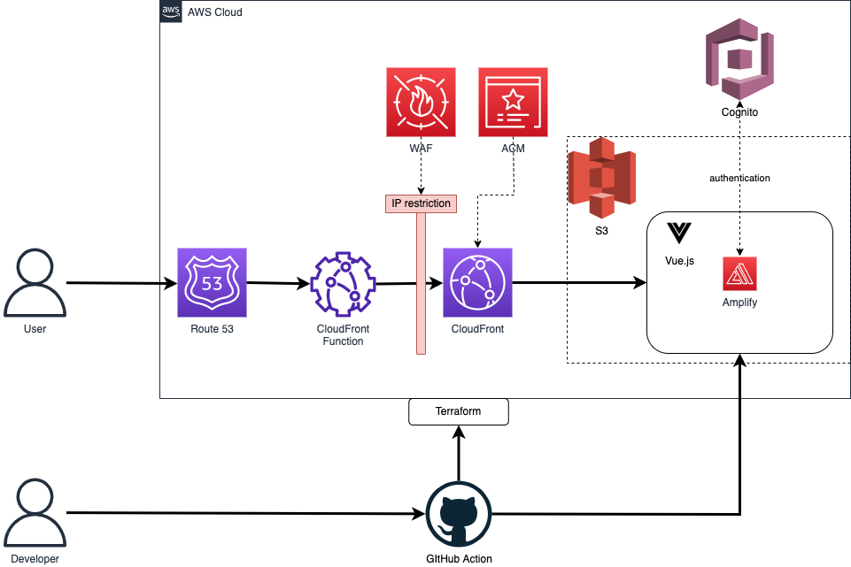

# terraform-amplify-nuxt-spa

====

## infra architecture




## repository architecture: Nuxt

[nuxt directory structure official](https://develop365.gitlab.io/nuxtjs-2.8.X-doc/ja/guide/directory-structure/)

## repository architecture: Terraform

[Module mode](https://www.terraform.io/language/modules)

```
.
└── terraform
    ├── common
    │   └── main.tf
    ├── environments
    │   ├── dev
    │   └── prod
    └── modules
        └── network
        └── storage
        └── credential
```

